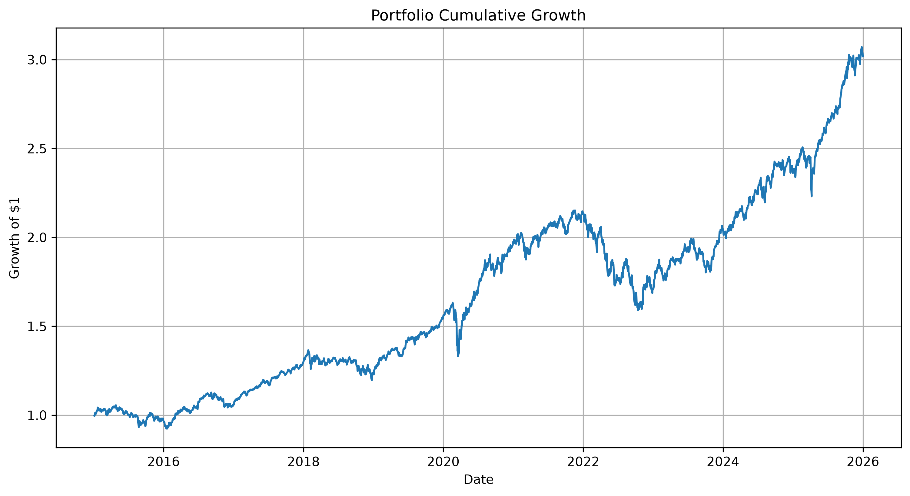
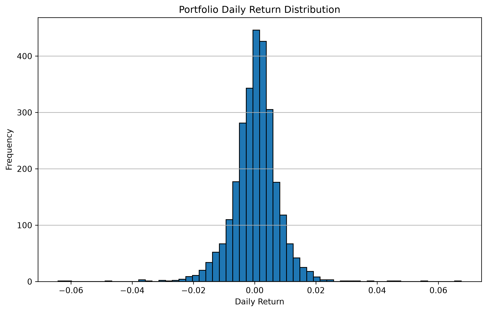
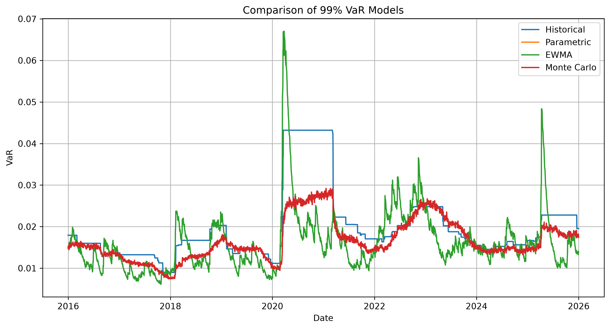
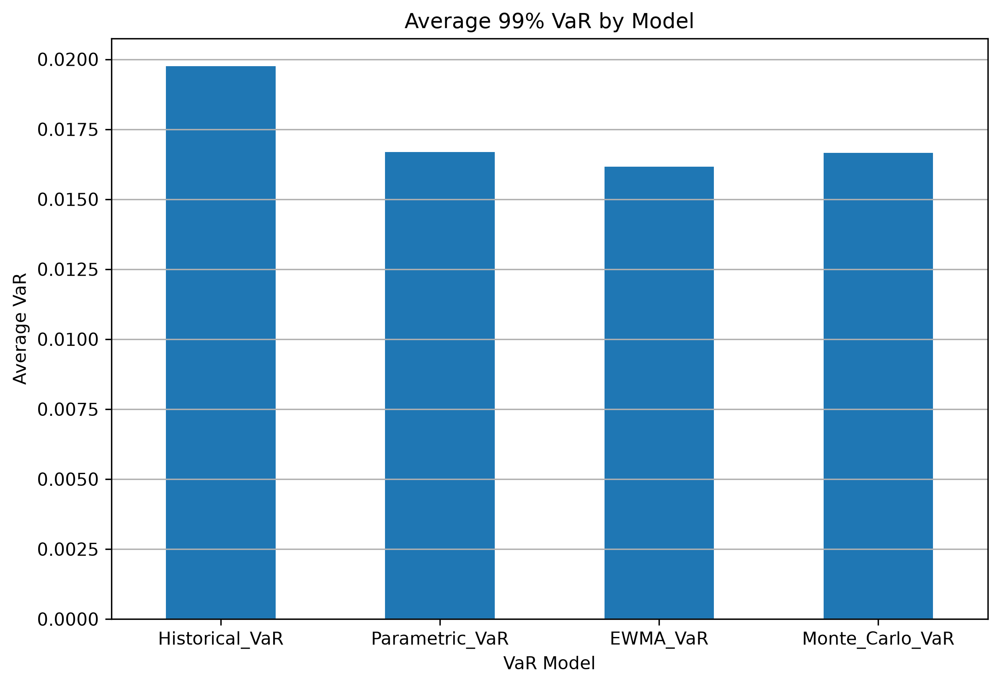
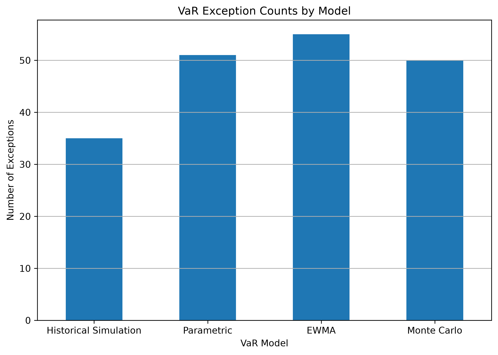
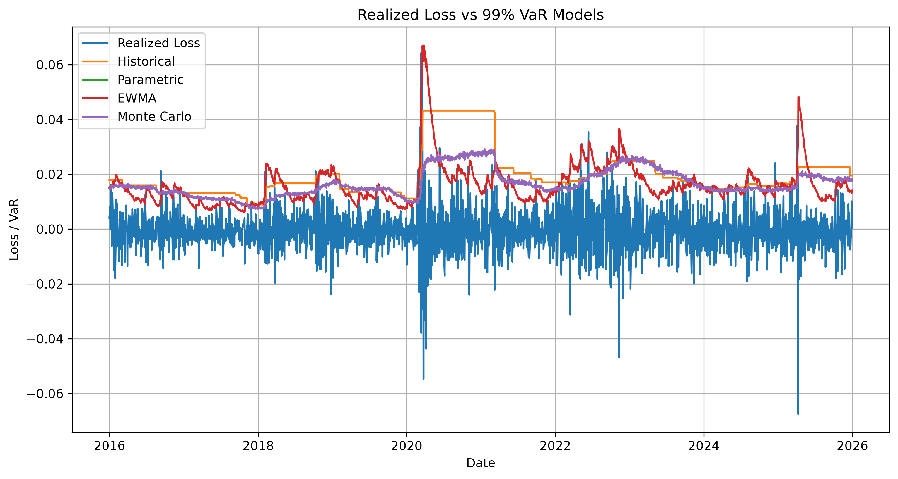
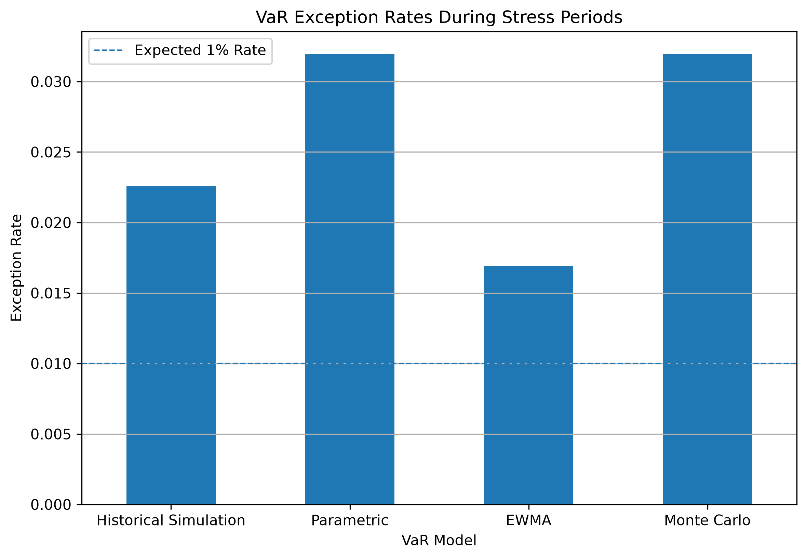

# Market Risk Model Monitoring & VaR Backtesting

## Executive Overview

This project develops an end-to-end **Market Risk Model Monitoring framework** for a diversified portfolio of five exchange-traded funds (ETFs): **SPY, QQQ, GLD, TLT, and EEM**. The framework estimates and evaluates **99% one-day Value-at-Risk (VaR)** using four complementary approaches: **Historical Simulation, Parametric VaR, EWMA VaR, and Monte Carlo Simulation**.

The analysis uses daily market data covering **2015–2025** and applies a **250-trading-day rolling estimation window** to generate **2,515 out-of-sample VaR observations**. Model performance is evaluated by comparing predicted VaR thresholds with realized portfolio losses and by applying formal statistical backtesting procedures, including the **Kupiec Proportion of Failures test, Christoffersen Independence test, and Christoffersen Conditional Coverage test**.

Beyond conventional VaR backtesting, the framework incorporates **rolling exception monitoring, exception severity analysis, volatility monitoring, drawdown analysis, and stress-period evaluation**. This provides a broader view of model behavior during changing market conditions rather than relying solely on aggregate VaR accuracy.

The project produces a complete set of **Python-based analytical outputs, statistical validation results, risk-monitoring visualizations, CSV model outputs, and an Excel-based model monitoring summary** designed to replicate a practical quantitative risk-management workflow.
go on
### Project Snapshot

| Component | Details |
|---|---|
| **Portfolio** | SPY, QQQ, GLD, TLT, EEM |
| **Portfolio Weighting** | 20% per asset |
| **Portfolio Value** | $1,000,000 |
| **Data Period** | 2015–2025 |
| **Trading-Day Observations** | 2,766 |
| **Portfolio Return Observations** | 2,765 |
| **VaR Confidence Level** | 99% |
| **Rolling Window** | 250 trading days |
| **Out-of-Sample Observations** | 2,515 |
| **VaR Models** | Historical, Parametric, EWMA, Monte Carlo |
| **Expected Exception Rate** | 1% |
| **Expected Exceptions** | 25.15 |
| **Annualized Portfolio Volatility** | ~11.995% |
| **High-Volatility Observations** | 274 |
| **≥10% Drawdown Observations** | 423 |

## Risk Management Context

Value-at-Risk (VaR) is a widely used market-risk measure for estimating the potential loss of a portfolio over a specified holding period and confidence level. However, a VaR estimate is only useful when the underlying model is regularly monitored and validated against realized market outcomes.

A model can produce a theoretically appropriate VaR estimate while still generating excessive exceptions, clustered breaches, or unstable forecasts during periods of elevated volatility. For this reason, this project treats VaR as a **model-monitoring problem rather than simply a VaR-calculation exercise**.

The framework therefore evaluates four different VaR methodologies under a common portfolio and backtesting framework. Their forecasts are compared with realized portfolio losses, statistically validated, and evaluated during periods of heightened volatility and significant portfolio drawdowns.

## Project Objectives

The project was designed to answer five primary risk-management questions:

1. **How large could a one-day portfolio loss be under normal market conditions?**
2. **How consistently do different VaR methodologies estimate the 99% loss threshold?**
3. **Do observed VaR exceptions occur at approximately the expected frequency?**
4. **Are VaR exceptions independent, or do they cluster during periods of market stress?**
5. **How does each VaR model behave when portfolio volatility and drawdowns increase?**

To answer these questions, the project combines:

- Portfolio return and volatility analysis
- Four independent VaR methodologies
- Rolling out-of-sample forecasting
- VaR exception analysis
- Kupiec statistical backtesting
- Christoffersen Independence testing
- Christoffersen Conditional Coverage testing
- Rolling exception-rate monitoring
- Volatility and drawdown analysis
- Stress-period model comparison
- Excel-based risk-monitoring outputs

## 3. Portfolio & Dataset

### Portfolio Construction

The portfolio consists of five ETFs representing different market exposures:

| Asset | Ticker | Portfolio Weight |
|---|---|---:|
| SPDR S&P 500 ETF Trust | SPY | 20% |
| Invesco QQQ Trust | QQQ | 20% |
| SPDR Gold Shares | GLD | 20% |
| iShares 20+ Year Treasury Bond ETF | TLT | 20% |
| iShares MSCI Emerging Markets ETF | EEM | 20% |

The portfolio is constructed using an **equal-weighted allocation**, with each asset contributing 20% of the total portfolio value. A hypothetical portfolio value of **$1,000,000** is used throughout the risk calculations.

### Market Data

The analysis uses daily market observations covering **2015–2025**. The original dataset contains **2,766 trading-day observations** across the five assets.

Data-quality validation was performed before constructing the portfolio. The analysis confirmed:

- **0 missing values**
- **0 duplicate dates**
- **0 duplicate rows**
- **0 non-positive price observations**

Daily percentage returns were calculated for each asset and combined using the portfolio weights to obtain the portfolio return series.

After return calculation, the portfolio contains **2,765 daily return observations**.

### Portfolio Risk Characteristics

The resulting portfolio has approximately **11.995% annualized volatility**. This return series forms the foundation for all four VaR methodologies, rolling forecasts, statistical backtests, and stress analysis performed in the project.

### Portfolio Performance





## 4. Value-at-Risk Methodology

The project implements four complementary **99% one-day VaR methodologies**. Each model uses the same portfolio return series and a common **250-trading-day rolling estimation window**, allowing the methodologies to be compared under consistent conditions.

### 4.1 Historical Simulation VaR

Historical Simulation estimates VaR directly from the empirical distribution of historical portfolio returns.

For each rolling window, historical portfolio returns are ranked and the **1st percentile loss threshold** is used as the 99% VaR estimate. This approach does not impose a normality assumption on portfolio returns and therefore preserves the observed shape of the historical return distribution.

### 4.2 Parametric VaR

Parametric VaR estimates portfolio risk using the portfolio's historical mean and volatility over the rolling estimation window.

The model assumes that portfolio returns follow a parametric distribution and uses the corresponding **99% quantile** to calculate the one-day VaR threshold.

This approach provides a computationally efficient benchmark against which the non-parametric and simulation-based models can be compared.

### 4.3 EWMA VaR

The Exponentially Weighted Moving Average (EWMA) approach gives greater importance to recent observations when estimating portfolio volatility.

This allows the model to respond more quickly to changing market conditions than a simple rolling volatility estimate.

The resulting time-varying volatility estimate is incorporated into the 99% VaR calculation to produce a dynamically changing risk forecast.

### 4.4 Monte Carlo VaR

Monte Carlo VaR estimates the loss distribution by simulating portfolio returns from the estimated distribution of historical portfolio returns.

For each rolling window, the model estimates the relevant distribution parameters and generates **10,000 simulated returns**. The 1st percentile of the simulated return distribution is then used to determine the 99% one-day VaR estimate.

The simulation approach provides an additional benchmark for evaluating whether a distribution-based model produces materially different risk estimates from Historical Simulation, Parametric, and EWMA methodologies.

### VaR Model Comparison

The following visualization compares the 99% VaR forecasts generated by all four methodologies over the out-of-sample period.



### Average VaR by Model



## 5. Rolling Out-of-Sample Forecasting & Exception Framework

To avoid evaluating the models only on the same observations used to estimate them, the project uses a **rolling out-of-sample forecasting framework**.

Each VaR model uses a **250-trading-day historical window** to estimate the required parameters and generate the next day's 99% VaR forecast. The estimation window then rolls forward by one trading day and the process is repeated throughout the dataset.

This produces **2,515 out-of-sample VaR observations** for each model.

### VaR Exception Definition

A VaR exception occurs when the realized portfolio loss exceeds the corresponding model's predicted VaR:

**Realized Loss > VaR Forecast**

At a **99% confidence level**, the theoretical exception rate is **1%**. Therefore, across 2,515 out-of-sample observations, approximately **25.15 exceptions** would be expected if the VaR model were correctly calibrated to the observed loss distribution.

### Observed VaR Exceptions

The four models produced the following results:

| Model | Exceptions | Exception Rate | Expected Exceptions |
|---|---:|---:|---:|
| Historical Simulation | 35 | 1.392% | 25.15 |
| Parametric | 51 | 2.028% | 25.15 |
| EWMA | 55 | 2.187% | 25.15 |
| Monte Carlo | 50 | 1.988% | 25.15 |

Historical Simulation generated the fewest observed exceptions at **35**, while EWMA generated the highest number at **55**. All four models recorded exception rates above the theoretical **1%** level over the observed backtesting period.

### Exception Count Comparison



### Realized Losses vs VaR Forecasts

Comparing realized portfolio losses with model VaR forecasts provides a direct visual assessment of when actual losses breached the estimated risk threshold.



## 6. Statistical VaR Backtesting

Exception counts alone do not provide a complete assessment of VaR model quality. A model may generate an acceptable number of exceptions but still produce violations that cluster together during periods of market stress.

To evaluate both the frequency and temporal behavior of VaR exceptions, three formal statistical backtesting procedures were implemented.

### 6.1 Kupiec Proportion of Failures Test

The **Kupiec Proportion of Failures (POF) test** evaluates whether the observed proportion of VaR exceptions is statistically consistent with the expected exception rate.

For the 99% VaR framework, the null hypothesis assumes an exception probability of **1%**.

The test compares the observed exception frequency against this theoretical rate using a likelihood-ratio statistic.

In the project results, the four models received a **Pass** decision under the Kupiec test.

### 6.2 Christoffersen Independence Test

The **Christoffersen Independence test** evaluates whether VaR exceptions occur independently over time.

This is important because exceptions that cluster together may indicate that the model fails to respond adequately to changing market volatility or evolving risk conditions.

The test evaluates transitions between exception and non-exception observations and determines whether violations exhibit statistically significant dependence.

For the four models evaluated in this project, the Independence test resulted in a **Reject** decision.

### 6.3 Christoffersen Conditional Coverage Test

The **Christoffersen Conditional Coverage test** combines the coverage property assessed by the Kupiec test with the independence property assessed by the Christoffersen Independence test.

It therefore provides a broader assessment of whether a VaR model:

1. Generates exceptions at the expected frequency; and
2. Produces exceptions independently over time.

The four models received a **Reject** decision under the Conditional Coverage test.

### Statistical Backtesting Summary

| Model | Kupiec | Independence | Conditional Coverage |
|---|---|---|---|
| Historical Simulation | Pass | Reject | Reject |
| Parametric | Pass | Reject | Reject |
| EWMA | Pass | Reject | Reject |
| Monte Carlo | Pass | Reject | Reject |

The results indicate that while the models' overall exception frequencies were not rejected by the Kupiec test, the **independence and conditional coverage results indicate limitations in how the models respond to changing market conditions and clustered risk events**.

For this reason, the framework does not rely on a single statistical test. Instead, exception monitoring is combined with rolling validation, volatility analysis, drawdown analysis, and stress-period testing.

## 7. Rolling Validation & Model Monitoring

VaR performance can change over time as market volatility, return distributions, and portfolio risk conditions evolve. To capture this behavior, the project extends static backtesting with a **rolling model-monitoring framework**.

A **250-trading-day rolling window** is used to monitor the frequency of VaR exceptions over time. For each model, exception indicators are converted into a rolling exception rate, allowing periods of increased model violations to be identified rather than relying only on the full-sample exception rate.

### Rolling Exception-Rate Monitoring

The theoretical exception rate for a 99% VaR model is **1%**. The rolling framework therefore compares each model's observed exception rate with this benchmark throughout the out-of-sample period.

The monitoring framework tracks:

- Rolling VaR exception rates
- Exception counts
- Realized losses exceeding predicted VaR
- Average exception severity
- Differences between VaR methodologies
- Changes in model behavior over time

### Model-Level Validation

The rolling framework allows the four methodologies to be evaluated under the same out-of-sample conditions:

| Model | Total Exceptions | Exception Rate |
|---|---:|---:|
| Historical Simulation | 35 | 1.392% |
| Parametric | 51 | 2.028% |
| EWMA | 55 | 2.187% |
| Monte Carlo | 50 | 1.988% |

Historical Simulation produced the lowest exception count, while EWMA produced the highest. The results show that the choice of VaR methodology materially affects the frequency of observed breaches.

### Rolling Exception Rates


The rolling monitoring approach complements the formal statistical tests by providing a time-series view of model behavior. Periods of elevated exception rates can be investigated alongside changes in portfolio volatility and drawdowns to determine whether model breaches are associated with stressed market conditions.

## 8. Stress & Volatility Analysis

Standard VaR backtesting provides an aggregate view of model performance, but risk models can behave differently when market conditions deteriorate. The project therefore incorporates a separate **volatility, drawdown, and stress-period monitoring framework**.

### 8.1 Volatility Monitoring

A **30-day rolling annualized volatility** measure was calculated for the portfolio to identify periods in which market risk increased materially.

A high-volatility threshold was defined using the **90th percentile** of the portfolio's rolling volatility distribution.

- **90th-percentile volatility threshold:** ~15.78%
- **High-volatility observations:** 274

Observations at or above this threshold were classified as high-volatility periods and used as part of the broader stress-monitoring framework.

### 8.2 Drawdown Monitoring

Portfolio cumulative performance was used to calculate drawdowns from the running portfolio peak.

A drawdown threshold of **10%** was used to identify periods of significant portfolio stress.

- **Observations with drawdowns of at least 10%:** 423

This provides an additional risk perspective because a VaR model may behave differently during sustained portfolio declines than during ordinary market conditions.

### 8.3 Stress-Period Definition

An observation was classified as a **stress period** when it satisfied either of the following conditions:

- 30-day annualized volatility was at or above the 90th-percentile threshold; or
- Portfolio drawdown was at least 10%.

The resulting stress-period dataset was then used to compare VaR exception behavior across the four models.

### 8.4 Stress-Period VaR Performance

| Model | Stress Exceptions | Stress Exception Rate |
|---|---:|---:|
| Historical Simulation | 12 | 2.26% |
| Parametric | 17 | 3.20% |
| EWMA | 9 | 1.69% |
| Monte Carlo | 17 | 3.20% |

EWMA recorded the lowest stress-period exception rate at **1.69%**, while Parametric and Monte Carlo VaR both recorded **3.20%**. Historical Simulation recorded a **2.26%** stress-period exception rate.

These results highlight the importance of evaluating VaR models specifically during periods of elevated market risk rather than relying solely on full-sample performance.

### Stress-Period Exception Rates



### 8.5 Tail-Risk Analysis

The framework also identified the **10 worst portfolio trading days** and the **10 highest-volatility observations**. These observations provide additional insight into the behavior of portfolio losses and volatility during extreme market conditions.

The stress analysis therefore complements statistical VaR backtesting by examining whether model forecasts remain informative when portfolio risk increases substantially.

## 9. Model Comparison & Key Findings

The four VaR methodologies produced materially different risk forecasts and exception frequencies over the 2,515-observation out-of-sample period. Comparing the models across exception frequency, statistical backtesting, and stress-period behavior provides a more complete assessment than relying on a single performance measure.

### 9.1 Overall VaR Performance

| Model | Exceptions | Exception Rate | Stress Exceptions | Stress Exception Rate |
|---|---:|---:|---:|---:|
| Historical Simulation | 35 | 1.392% | 12 | 2.26% |
| Parametric | 51 | 2.028% | 17 | 3.20% |
| EWMA | 55 | 2.187% | 9 | 1.69% |
| Monte Carlo | 50 | 1.988% | 17 | 3.20% |

Historical Simulation generated the **fewest overall exceptions (35)** and an exception rate of **1.392%**, making it the closest to the theoretical 1% exception rate among the four models based on observed exception frequency.

EWMA generated the **highest overall number of exceptions (55)** and an exception rate of **2.187%**. However, it recorded the **lowest stress-period exception rate at 1.69%**, suggesting that its time-varying volatility approach produced comparatively stronger performance during the defined stress periods.

Parametric and Monte Carlo VaR produced similar overall exception rates of **2.028% and 1.988%**, respectively. Both models recorded a **3.20% stress-period exception rate**, the highest among the four methodologies.

### 9.2 Statistical Backtesting

The Kupiec test produced a **Pass** decision for all four models, indicating that the observed exception frequencies were not rejected by that test at the selected significance level.

However, all four models received **Reject** decisions under both the **Christoffersen Independence test** and the **Conditional Coverage test**.

This indicates that exception frequency alone does not fully capture model behavior. The temporal behavior of exceptions and their relationship with changing market conditions remain important considerations for model monitoring.

### 9.3 Stress-Period Comparison

Stress-period analysis produced a different ranking from the full-sample exception comparison.

**EWMA** recorded only **9 stress-period exceptions**, corresponding to a **1.69% exception rate**, compared with:

- Historical Simulation: **12 exceptions / 2.26%**
- Parametric: **17 exceptions / 3.20%**
- Monte Carlo: **17 exceptions / 3.20%**

This demonstrates why model evaluation should incorporate both **full-sample backtesting and stress-period analysis**.

### 9.4 Overall Interpretation

No single VaR methodology should be evaluated using exception count alone. Historical Simulation performed best in terms of overall exception frequency, while EWMA demonstrated the lowest exception rate during the specifically defined stress periods.

The statistical tests also indicate that all four models require continued monitoring because their exception sequences did not satisfy the independence and conditional coverage criteria.

The results support a **multi-model monitoring approach**, where VaR forecasts are evaluated alongside statistical backtesting, rolling exception rates, volatility conditions, and drawdown behavior rather than relying on a single VaR methodology.

### VaR Forecast Comparison


## 10. Model Monitoring Framework

The project is structured as a repeatable **market risk model monitoring framework** rather than a one-time VaR calculation. The objective is to provide multiple layers of validation so that changes in model performance can be identified and investigated.

### 10.1 Monitoring Layers

The framework combines five complementary monitoring layers:

| Monitoring Layer | Purpose |
|---|---|
| **VaR Forecast Monitoring** | Tracks the daily 99% VaR forecast produced by each methodology |
| **Exception Monitoring** | Identifies instances where realized losses exceed predicted VaR |
| **Statistical Backtesting** | Evaluates exception frequency, independence, and conditional coverage |
| **Volatility & Drawdown Monitoring** | Identifies changing portfolio risk and stressed market conditions |
| **Stress-Period Analysis** | Compares model behavior specifically during elevated-risk periods |

### 10.2 Model Monitoring Indicators

The framework produces several indicators that can be monitored over time:

- Daily VaR forecasts
- Realized portfolio losses
- VaR exception counts
- Exception rates
- Rolling exception rates
- Exception severity
- Kupiec likelihood-ratio statistics and p-values
- Christoffersen Independence statistics and p-values
- Conditional Coverage statistics and p-values
- Rolling portfolio volatility
- Portfolio drawdowns
- Stress-period exception rates

### 10.3 Model Review Logic

The monitoring framework is designed to identify situations requiring further model review.

A model may warrant investigation when:

- Actual exception rates materially exceed the theoretical 1% level.
- VaR exceptions become clustered over time.
- Statistical backtesting produces rejection decisions.
- Exception frequency increases during changing volatility conditions.
- Model performance deteriorates during stress periods.
- Different VaR methodologies produce materially different risk estimates.

The framework therefore emphasizes **continuous model validation rather than relying on a single pass/fail metric**.

### 10.4 Monitoring Outputs

The project produces both analytical and reporting-ready outputs:

- Python/Jupyter analytical notebook
- Model-specific VaR result files
- Statistical backtesting results
- Rolling validation results
- Stress-period analysis
- Risk-monitoring visualizations
- Excel-based model monitoring summary

These outputs provide a reproducible record of the model calculations and validation results and can be used as the foundation for periodic risk-model review.

## 11. Key Conclusions & Risk Insights

The analysis demonstrates that VaR model performance can vary materially depending on the methodology used and the market conditions under which the model is evaluated.

### 11.1 Overall Model Performance

Historical Simulation produced the lowest overall exception count at **35 exceptions (1.392%)**, compared with the theoretical 1% exception rate. This was the closest observed exception frequency to the expected level among the four models.

Parametric VaR produced **51 exceptions (2.028%)**, while Monte Carlo VaR produced **50 exceptions (1.988%)**. EWMA recorded the highest overall exception count at **55 (2.187%)**.

### 11.2 Stress-Period Performance

The stress analysis produced a different performance pattern.

EWMA recorded the lowest stress-period exception rate at **1.69%**, with **9 exceptions**. Historical Simulation recorded **12 exceptions (2.26%)**, while both Parametric and Monte Carlo recorded **17 exceptions (3.20%)**.

This difference demonstrates that a model's full-sample performance does not necessarily indicate how it will behave during periods of elevated volatility or significant portfolio drawdowns.

### 11.3 Statistical Validation

All four models passed the **Kupiec Proportion of Failures test**, but all four received **Reject** decisions under both the **Christoffersen Independence test** and the **Conditional Coverage test**.

The results suggest that exception frequency alone is not sufficient for assessing VaR model adequacy. The temporal behavior of exceptions and their relationship with changing market conditions are also important components of model validation.

### 11.4 Risk Monitoring Implications

The project highlights the importance of maintaining a multi-dimensional monitoring framework.

The combination of:

- VaR exception frequency
- Statistical backtesting
- Rolling exception rates
- Volatility monitoring
- Drawdown analysis
- Stress-period performance

provides a more comprehensive assessment of model behavior than any individual metric.

The analysis also demonstrates that **model selection should not be based solely on which methodology produces the lowest VaR or the fewest exceptions**. Different methodologies can behave differently under normal and stressed conditions, making ongoing validation and monitoring essential.

### 11.5 Overall Conclusion

The completed framework provides a reproducible approach for comparing and monitoring multiple market-risk models. Historical Simulation showed the closest overall exception frequency to the theoretical 1% level, while EWMA demonstrated the lowest exception rate during the defined stress periods.

At the same time, the rejection of the Independence and Conditional Coverage tests across all four models indicates that the models should remain subject to continued monitoring and investigation, particularly during periods of changing volatility and market stress.

## 12. Project Outputs & Deliverables

The project produces a complete set of analytical, validation, visualization, and reporting outputs.

### 12.1 Python/Jupyter Analysis

The main Jupyter Notebook contains the complete Python implementation of the project, including:

- Data preparation and quality checks
- Portfolio construction
- Return and volatility analysis
- Historical Simulation VaR
- Parametric VaR
- EWMA VaR
- Monte Carlo VaR
- Rolling out-of-sample forecasting
- VaR exception identification
- Statistical backtesting
- Rolling validation
- Stress and volatility analysis
- Model comparison
- Visualization generation

### 12.2 VaR Model Results

Model-specific CSV outputs contain the calculated VaR forecasts and supporting results for:

- Historical Simulation
- Parametric VaR
- EWMA VaR
- Monte Carlo VaR

These outputs provide a reproducible record of the model forecasts used during the backtesting process.

### 12.3 Statistical Validation Outputs

The repository contains statistical validation results covering:

- VaR exception counts
- Exception rates
- Kupiec Proportion of Failures test
- Christoffersen Independence test
- Christoffersen Conditional Coverage test
- Rolling validation metrics
- Model-level validation decisions

### 12.4 Stress Analysis Outputs

The stress-analysis outputs contain:

- Rolling portfolio volatility
- High-volatility observations
- Portfolio drawdowns
- Stress-period identification
- Stress-period VaR exceptions
- Stress-period exception rates
- Model-level stress performance

### 12.5 Excel Model Monitoring Summary

The Excel workbook provides a consolidated reporting layer containing:

- **Executive Summary**
- **VaR Comparison**
- **Backtesting**
- **Stress Analysis**
- **Model Backtesting & Validation Ranking**

The workbook is designed to provide a concise view of the model-monitoring results without requiring the user to execute the Python analysis.

### 12.6 Risk-Monitoring Visualizations

The project includes eight analytical visualizations covering portfolio performance, return behavior, VaR forecasts, exception patterns, and stress-period performance:

1. Portfolio cumulative growth
2. Portfolio return distribution
3. Historical Simulation VaR monitoring
4. Realized loss versus VaR models
5. VaR model comparison
6. Average VaR by model
7. VaR exception counts
8. Stress-period exception rates

## 13. Repository Structure

The repository is organized to separate the analytical implementation, model outputs, visualizations, and reporting deliverables.

```text
Market-Risk-Model-Monitoring/
│
├── market_risk_model_monitoring.ipynb
│
├── outputs/
│   │
│   ├── figures/
│   │   ├── average_var_by_model.png
│   │   ├── historical_var_monitoring.png
│   │   ├── portfolio_cumulative_growth.png
│   │   ├── portfolio_return_distribution.png
│   │   ├── realized_loss_vs_var.png
│   │   ├── stress_period_exception_rates.png
│   │   ├── var_exception_counts.png
│   │   └── var_model_comparison.png
│   │
│   ├── model_results/
│   │   ├── historical_var_results.csv
│   │   ├── parametric_var_results.csv
│   │   ├── ewma_var_results.csv
│   │   ├── monte_carlo_var_results.csv
│   │   ├── var_backtesting_comparison.csv
│   │   ├── statistical_backtesting_results.csv
│   │   ├── rolling_validation_summary.csv
│   │   └── stress_period_analysis.csv
│   │
│   └── Market_Risk_Model_Monitoring_Summary.xlsx
│
└── README.md
```

## 14. Technology Stack & Quantitative Techniques

### Technology Stack

| Technology | Application |
|---|---|
| **Python** | Core market-risk analysis, VaR modelling, backtesting, validation, and stress analysis |
| **Jupyter Notebook** | Development environment and reproducible analytical workflow |
| **Pandas** | Data manipulation, return calculations, rolling-window analysis, and result generation |
| **NumPy** | Numerical calculations, portfolio computations, and Monte Carlo simulation |
| **SciPy** | Statistical distributions, likelihood-ratio testing, and VaR backtesting |
| **Matplotlib** | Risk-monitoring and model-comparison visualizations |
| **Microsoft Excel** | Consolidated model-monitoring tables and reporting |
| **GitHub** | Version control, project documentation, and portfolio presentation |

### Quantitative & Risk Techniques

The project applies the following quantitative finance and risk-management techniques:

- **Value-at-Risk (VaR)**
- **Historical Simulation**
- **Parametric / Variance-Covariance VaR**
- **Exponentially Weighted Moving Average (EWMA)**
- **Monte Carlo Simulation**
- **Rolling Out-of-Sample Forecasting**
- **VaR Exception Analysis**
- **Kupiec Proportion of Failures Test**
- **Christoffersen Independence Test**
- **Christoffersen Conditional Coverage Test**
- **Rolling Exception-Rate Monitoring**
- **Volatility Analysis**
- **Drawdown Analysis**
- **Stress Testing**
- **Model Validation**
- **Market Risk Monitoring**
- **Time-Series Analysis**

### Analytical Workflow

The overall workflow can be summarized as:

```text
Market Data
     ↓
Data Quality Checks
     ↓
Asset Returns
     ↓
Equal-Weighted Portfolio
     ↓
Portfolio Risk Analysis
     ↓
99% VaR Models
     ├── Historical Simulation
     ├── Parametric VaR
     ├── EWMA VaR
     └── Monte Carlo VaR
     ↓
250-Day Rolling Out-of-Sample Forecasts
     ↓
VaR Exception Analysis
     ↓
Statistical Backtesting
     ├── Kupiec
     ├── Christoffersen Independence
     └── Conditional Coverage
     ↓
Rolling Validation
     ↓
Volatility & Drawdown Analysis
     ↓
Stress-Period Analysis
     ↓
Model Comparison & Monitoring
     ↓
Excel Reporting + Visual Outputs

## 15. Limitations, Disclaimer & Future Improvements

### 15.1 Limitations

The framework is designed as a portfolio and educational implementation of market-risk model monitoring and therefore has several limitations.

- The portfolio uses a fixed **20% allocation** to each of the five ETFs and does not incorporate dynamic portfolio rebalancing.
- The analysis focuses on **one-day 99% VaR** and does not evaluate alternative confidence levels or multi-day holding periods.
- The VaR methodologies rely on historical market behavior and therefore may not fully capture unprecedented future market conditions.
- The Monte Carlo framework is based on estimated historical distribution characteristics and does not model all possible forms of market dependence or regime changes.
- Transaction costs, liquidity constraints, bid-ask spreads, taxes, and market-impact effects are not incorporated.
- The framework evaluates market risk at the portfolio level and does not include other risk categories such as credit risk, liquidity risk, or operational risk.
- Statistical backtesting results are dependent on the selected sample period, rolling-window length, confidence level, and significance level.
- Stress periods are identified using predefined volatility and drawdown thresholds rather than through a full historical scenario-generation framework.

### 15.2 Future Improvements

The framework could be extended in several directions:

- Introduce **Expected Shortfall (ES / CVaR)** alongside VaR to measure losses beyond the VaR threshold.
- Evaluate multiple confidence levels such as **95%, 99%, and 99.5%**.
- Implement multi-day VaR forecasts for different risk horizons.
- Incorporate **GARCH-family volatility models** and alternative volatility forecasting techniques.
- Introduce time-varying portfolio weights and portfolio rebalancing.
- Model asset-level correlations using more advanced dependence structures.
- Expand the stress-testing framework using historical crisis scenarios and hypothetical shocks.
- Add automated model-performance alerts when exception rates or statistical test results breach predefined monitoring thresholds.
- Develop an interactive risk-monitoring dashboard for ongoing model surveillance.
- Compare model performance using additional measures such as **Expected Shortfall, exception severity, and forecast stability**.

### 15.3 Disclaimer

This project is intended for **educational, research, and portfolio demonstration purposes**. It is not a production risk-management system and should not be used as a basis for investment, trading, regulatory, or financial decisions.

The analysis and outputs are based on historical market data, model assumptions, and methodological choices described in this repository. Historical model performance does not guarantee future performance.

---

## Author

**Divyansh Sahai**

This project was developed as a quantitative market-risk and model-monitoring portfolio project, combining **Python-based risk modelling, statistical validation, stress analysis, and Excel-based reporting**.
